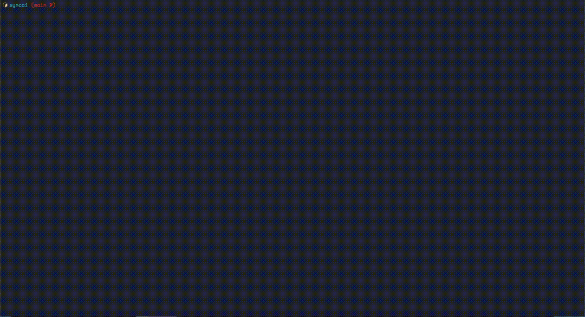

# AGRG - Dead simple AI Agent Rules Generator

<div align="center">

```
    █████╗  ██████╗ ██████╗  ██████╗ 
   ██╔══██╗██╔════╝ ██╔══██╗██╔════╝ 
   ███████║██║  ███╗██████╔╝██║  ███╗
   ██╔══██║██║   ██║██╔══██╗██║   ██║
   ██║  ██║╚██████╔╝██║  ██║╚██████╔╝
   ╚═╝  ╚═╝ ╚═════╝ ╚═╝  ╚═╝ ╚═════╝ 
```

**🎯 One source of truth for all your AI Agent rules**

[](https://opensource.org/licenses/MIT)
[](https://nodejs.org)
[](https://github.com/nxnom/agrg/pulls)

</div>

## 🤔 The Problem

Are you tired of maintaining separate instruction files for every AI code assistant? Do you find yourself copying and pasting the same rules across multiple files whenever you make updates?

## ✨ The Solution

AGRG (AI Agent Rules Generator) solves this by creating a single `Rules.md` file that automatically syncs to all your AI agent configuration files through symbolic links. 

**Edit once, update everywhere!**

## 🚀 Quick Start

### Installation

```bash
# Clone the repository
git clone https://github.com/nxnom/agrg.git
cd agrg

# Install dependencies
yarn install

# Link globally (optional)
yarn link
```

### Usage

```bash
# Interactive mode (recommended for first time)
agrg

# Skip all prompts and use defaults
agrg -y
```

## 📸 Demo

<div align="center">
  
</div>

## 🤝 Contributing

We welcome contributions! If your favorite AI agent or code editor isn't supported yet, please create a Pull Request.

### Adding Support for New AI Agents

1. Fork the repository
2. Edit `cli.js` and add your agent to the `SYMLINK_OPTIONS` array:
   ```javascript
   const SYMLINK_OPTIONS = [
     // ... existing options
     { name: 'Your Agent Name', value: '.youragentfile' }
   ];
   ```
3. Submit a Pull Request with:
   - The agent/editor name
   - The expected file location
   - A link to documentation (if available)

### Development

```bash
# Run locally
node cli.js
```

## 🔧 How It Works

1. **Creates `Rules.md`**: If it doesn't exist, AGRG creates it with sensible defaults
2. **Creates Symlinks**: Selected files are symlinked to `Rules.md`
3. **Updates `.gitignore`**: Optionally adds symlinked files to `.gitignore`
4. **Single Edit Point**: Edit `Rules.md` and all symlinked files update automatically

## 📄 License

MIT License - see [LICENSE](LICENSE) file for details

## 🐛 Issues & Feature Requests

Found a bug or have a feature request? Please [open an issue](https://github.com/nxnom/agrg/issues).

---

<div align="center">
  Made with ❤️ by developers, for developers
</div>
